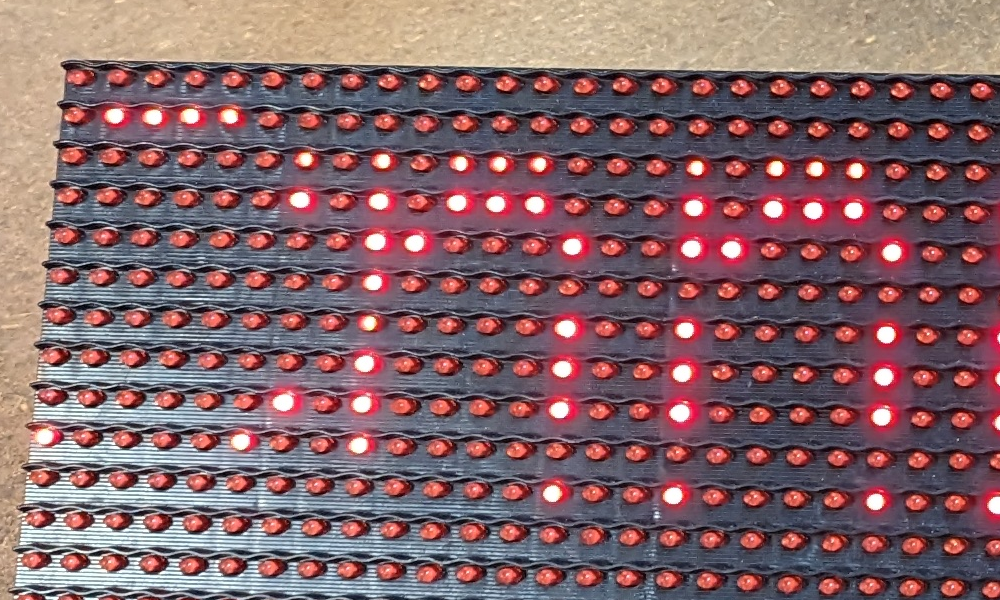

# CCHS LED Panel 
This panel is placed in CCHS and is mounted on a wall.

It is subcribed to MQTT messages and displays them on the wall.

There are two parts to this project:

1. The Aduino UNO that controlls the LED panel itself, code is in the folder "uno_DM2"
This code run the DM2 code and listens to the serial port for messages to display.

2. The MQTT server "esp32_mqtt_serial"
This code runs on the ESP32 and listens to the MQTT server for messages to send via serial to the Uno.
This is run on CCHS wifi and connect to the MQTT server hosted in the space.

